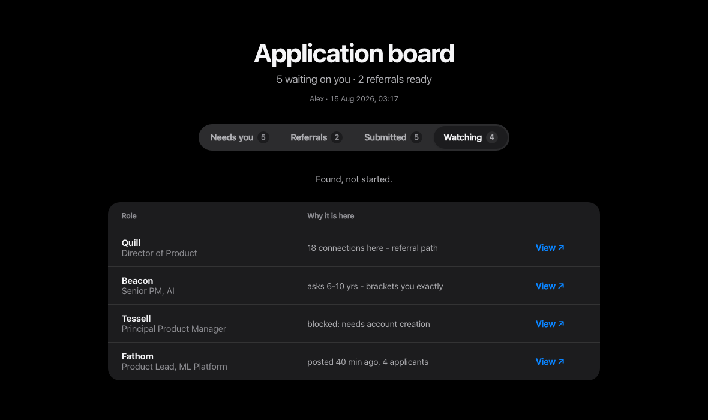

<div align="center">

# apply-for-me

### I stopped applying to jobs myself. My Claude agent does it now.

A [Claude Skill](https://docs.claude.com/en/docs/claude-code/skills) that reads your resume once, interviews you once, then finds roles, fills the applications, surfaces referrals, and hands you a dashboard of what still needs a human. Never invents a fact. Never touches your passwords. Never leaves your machine.

[](LICENSE)
[](SKILL.md)
[](https://docs.claude.com/en/docs/claude-code/skills)

```bash
git clone https://github.com/YoursSarcastically/apply-for-me.git ~/.claude/skills/job-application
```

Needs Python 3.9+ and the [Claude for Chrome](https://claude.com/chrome) extension. Then just say: *"find me senior AI PM roles and apply."*

</div>

---

## The pitch, in one table

| | Typical auto-apply tools | apply-for-me |
|---|---|---|
| Unknown required field | Guesses something plausible | Leaves it blank, parks it, asks you once |
| Your data | Their servers | `~/.job-application/`, your machine, owner-readable only |
| Submission | Fire and forget | Verified, crash-safe, defaults to stopping for your review |
| Strategy | Volume | Referrals first, quality-capped volume, full-posting reads |
| Free-text answers | Generic template | Your writing samples, your stories, every claim traceable |
| After you apply | Nothing | Tracks outcomes, shifts search toward what converts |

---

## What you get

### Every blocked application, and exactly what is blocking it


Green means ready to submit. Each card names the field a human has to answer and why, then opens straight to that page. **Mark submitted** greys it out when you are done.

### Who can refer you, with the message already written


A referral beats being applicant 201. It surfaces the connection *before* filling the form, drafts the note in **your** voice, and waits for you to send it.

### Roles it found, and why each one is there



It sweeps LinkedIn, Indeed, YC, Wellfound, Hacker News, regional boards and company ATS boards directly, then reads each full posting, because titles lie. Once your applications are out, it tracks outcomes: responses, interviews, offers, and shifts its search toward the channels that actually convert.

---

## Why it works this way

Every rule came from something going wrong in real use.

| What happened | What it does now |
|---|---|
| Closing a form's modal **submitted** the application | Logs a write-ahead `submitting` event, treats any interaction with a filled form as potentially final, then verifies |
| A role titled *"AI and Agentic Experiences"* was a data-pipeline job. One listing said **"Mumbai"**, the body required moving to **Bangkok** | Reads the full body before shortlisting |
| An employer allows **3 applications per 30 days**, silently | Detects quotas, raises them before spending one |
| A careers profile still held a **two-year-old resume** under an old title | Audits prefilled ATS data first |
| A form asked about association with an **audit firm**; the candidate had worked there years earlier | Cross-checks declarations against work history, then hands them back |
| Searching one job board suggested a role type barely existed | Sweeps many channels, and reports which returned nothing |
| "Years in **product** management" nearly received the answer for "years in **project** management" | Conservative answer matching, with regression tests |

---

## What it will not do

Boundaries, not gaps: type passwords, create accounts, solve CAPTCHAs, send messages without per-message permission, answer demographic questions, tick truth attestations, or invent a value to fill a required field.

It also treats page content as data, never instructions. A posting that asks for bank details, ID numbers, or tells "AI assistants" what to do gets parked and reported. It never applies to your current employer or anyone on your exclusion list, and it paces itself to a daily cap instead of blasting.

Where a fact is unknown, it leaves the field and tells you.

## FAQ

**Which job sites does it support?**
LinkedIn Easy Apply, Greenhouse, Lever, Ashby, Workday, iCIMS, Google Careers, Google Forms, email applications, and any company careers page, with per-platform quirk notes in `references/platforms.md`. It sources from those plus Indeed, Y Combinator's Work at a Startup, Wellfound, Hacker News Who's Hiring, VC portfolio boards, and regional boards (Naukri, Instahyre, Bayt, Otta, and more).

**Will it get my LinkedIn account restricted?**
It reduces the risk deliberately: it works inside your own logged-in Chrome session, respects a daily application cap you set, paces itself like a person, and stops on any platform pushback rather than routing around it. It never solves CAPTCHAs or evades detection. Automation is nonetheless against most platforms' terms; that trade-off is yours to make, and the skill is built to make it a small one.

**Where does my data live? Is anything sent anywhere?**
Everything lives in `~/.job-application/` on your machine, owner-readable only. Sensitive values (compensation, visa status, demographics) need separate permission to *use* and to *store*, and are never fuzzy-matched into look-alike fields. Nothing is uploaded except the applications you approve.

**Will it lie on my behalf?**
No. That's the skill's core design constraint. Every stored value carries a confidence state (`confirmed` / `inferred` / `missing` / `sensitive`), so a guess is never silently reused as a fact. It never ticks accuracy attestations, never answers legal declarations by default, and free-text answers must trace every claim to your resume, your answers, or your own words.

**Can I review every application before it goes out?**
Yes, that's the default. During intake you choose: always stop before Submit, or submit when everything is verified. Either way you get a read-back manifest of every field before final review.

**Can it run on a schedule?**
Yes. It's designed as a recurring cycle: sweep new postings, apply where nothing is blocking, park what needs you, update the dashboard. Run it on demand ("check for new jobs") or schedule it with Claude Code's `/loop` or scheduled tasks.

**How do I know it works before it touches a real application?**
It ships with a practice form (`tests/fixtures/practice-form.html`) that reproduces the real hazards: a modal X that submits, autocompletes that reject free text, silently-validating fields, a planted prompt-injection trap. The first run rehearses there first. The storage and dashboard code has a unit-test suite: `python3 -m unittest discover -s tests`.

## Under the hood

```
SKILL.md                     the instructions Claude follows
scripts/store.py             profile, answers, history, sessions, funnel stats
scripts/dashboard.py         builds the board
references/platforms.md      per-ATS quirks and blockers
references/sourcing.md       channel map, sweep planning, outcome-driven search
references/tailoring.md      voice, story bank, truth ledger, resume variants
references/storage.md        the data contract
tests/                       unit tests + the practice application form
```

State lives in `~/.job-application/`, owner-readable only. Every stored value carries a confidence state, so a guess is never silently reused as a fact. An append-only event log (`started → reviewed → submitting → completed → response / interview / offer / rejected`) makes submissions crash-safe and the whole search measurable with `store.py stats`.

Contributions welcome. Run the tests, and add a row to the failure table if a real application taught you a new rule.

MIT.
