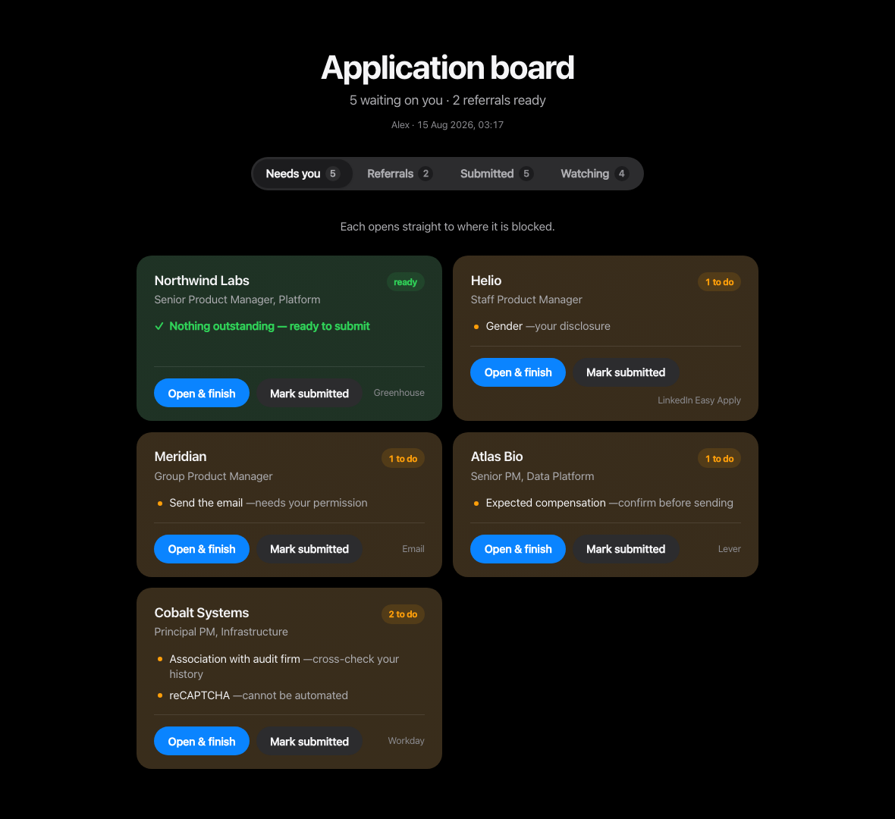
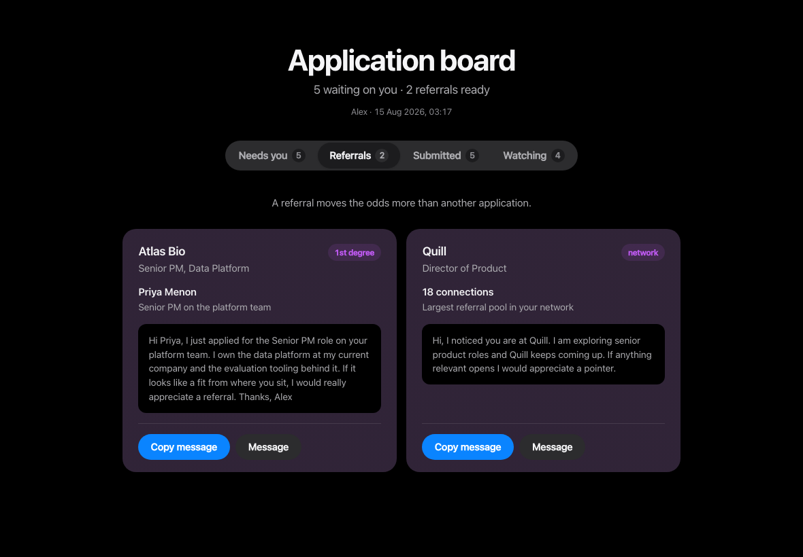

# job-application

A [Claude Skill](https://docs.claude.com/en/docs/claude-code/skills) that runs your job search as a **standing agent** rather than a one-off command: it reads your resume once, interviews you once, then fills applications across LinkedIn Easy Apply, Greenhouse, Lever, Ashby, Workday, iCIMS, Google Careers and company forms, surfaces the people in your network who could refer you, and hands you a dashboard of what still needs a human.

Every rule in it exists because something went wrong without it during real use. Those failure modes are documented below, since they are the interesting part.



---

## Why this exists

Job applications are a bad fit for naive automation. They are:

- **Irreversible.** A wrong salary figure or an overstated year count follows you into interviews.
- **Legally loaded.** Auditor-independence checks, government-official declarations, work authorization, truth attestations. These are compliance questions wearing the costume of screening questions.
- **Deceptively labelled.** Titles routinely misrepresent the job.
- **Full of hard stops.** CAPTCHAs, account creation, native OS file pickers.

The temptation is to build something that blasts out applications. This skill deliberately does not. It optimises for *fewer interruptions* rather than *no human*, and it treats "never fabricate an answer" as the constraint that everything else bends around.

---

## Install

```bash
git clone https://github.com/YoursSarcastically/apply-for-me.git ~/.claude/skills/job-application
```

Or drop the `job-application/` folder into `~/.claude/skills/`. Claude picks it up on the next session.

Requires Python 3.9+ (standard library only, no dependencies) and a browser integration such as Claude in Chrome.

---

## How it works

```
job-application/
├── SKILL.md                  the instructions Claude follows
├── scripts/
│   ├── store.py              local profile, answers, history, sessions
│   └── dashboard.py          builds the status artifact
└── references/
    ├── platforms.md          per-ATS quirks and expected blockers
    └── storage.md            storage contract and confidence model
```

### Six phases

**1. Intake, once.** You give it a resume. It extracts what it can, shows you what it got, then asks the questions resumes never answer but forms always demand: fixed versus total compensation, notice period, work authorization *per country*, relocation, per-role cities, education months, past audit-firm association, demographic preferences.

That last cluster is the point. Most mid-application interruptions are avoidable — the information was knowable upfront. Front-loading it is what makes the rest low-touch.

**2. Finding roles.** Sweeps **many channels, not one site**: general aggregators, startup-native boards (YC, Wellfound, HN Who's Hiring), regional boards, and company ATS boards directly via `site:job-boards.greenhouse.io` style searches. Then **reads each full posting before shortlisting**, because titles lie (see below).

Searching only LinkedIn produces a specific false conclusion: that a role type barely exists, when the openings are on boards LinkedIn never indexed. A real sweep for senior AI product roles returned 1,000+ LinkedIn results that were mostly banking and insurance PM roles, while the AI-native openings sat elsewhere.

Public boards still have a ceiling, so the skill also covers what search structurally cannot reach:

- **Log in before sweeping.** Instahyre, Naukri, Cutshort and Wellfound show a fraction of listings to logged-out visitors. A logged-out search still returns results, just a thin and unrepresentative slice, which is what makes this easy to miss. Cheapest and largest single unlock.
- **VC portfolio boards.** Funds publish job pages across their whole portfolio, carrying roles aggregators never see, skewed toward well-funded startups.
- **Catch postings in their first hour.** Applicant count matters more than almost any other signal: three applicants at one hour old is a different proposition from 200+ at two weeks. Sort by recent, not relevance, since relevance ranking buries new postings.
- **Recruiter outreach.** A large share of senior roles are filled before anything is published. No scraper reaches these. It is a structural limit, not a gap to engineer around.

The skill is also honest about stopping. When new searches keep returning roles already seen, it says so — past that point volume is motion, not progress, and the return shifts to converting what has already been found.

**3. Referrals first.** For any role where you have a connection, it surfaces that *before* filling the form and drafts the outreach. A referral on a role with 200 applicants beats being applicant 201.

**4. Filling.** Identifies the ATS, reads the relevant platform notes, fills from your stored profile, verifies every few fields. Never invents. Stops at legal declarations.

**5. Dashboard.** Generates a self-contained status page showing what needs you, with a direct link to each blocked page.

**6. Repeat.** The natural shape is a cycle, not a session. Sweep, dedupe against history, triage, apply where nothing is blocking, park what is blocked, republish the dashboard to the same URL, report in a few lines. Run it on demand or on a schedule.

Steps 1 through 5 need no input, which is the whole return on the intake phase. A cycle that interrupts three times has usually skipped something intake should have captured.

### It behaves as an agent, not a handler

The objective is standing: get you into a better role while spending as little of your attention as possible. That changes defaults. It carries state across sessions in the store rather than the conversation, acts without checking in inside a cycle, and will tell you when the thing you asked for is not the thing that helps — if you ask for more roles when what you need is to send three referral messages, it says so.

It also knows its limits and names them rather than working around them: credentials, CAPTCHAs, legal attestations, and anything it would have to invent.

### Two kinds of memory

The **application store** (`~/.job-application/`) holds operational state that churns: profile, answers, history, in-progress sessions.

**Claude's own memory** holds durable facts that outlive the search: standing constraints, how you want the work done, that you are looking at all. The skill writes there deliberately and does not mirror application state into it, because a memory file full of stale statuses is worse than none — it reads as current.

### The confidence model

The part most likely to be useful elsewhere.

Every stored value carries a state:

| State | Meaning | Reused silently? |
|---|---|---|
| `confirmed` | You said it or approved it | Yes |
| `inferred` | Claude derived it from context | **No** — re-shown each time |
| `missing` | Unknown | No — asks |
| `sensitive` | Pay, visa, demographics, disability | Never — confirmed every use |

`inferred` is the one that matters. When a form demands a city for a job your resume only dates, that value is a guess. Without a label, the next session cannot distinguish it from fact, and a guess quietly hardens into a claim on your applications. The label is the whole defence.

Sensitive values enforce **two separate permissions**: may I use this now, and may I store it. Permission to fill is not permission to remember.

---

## What went wrong to produce these rules

### Closing a form submitted it

On a LinkedIn Easy Apply flow with a Greenhouse backend, clicking the modal's **X to close** submitted the completed application. The assurance "I will stop before Submit" was structurally false, and a referral question that had deliberately been left blank went out unanswered.

**Rule:** treat any interaction with a completed form as potentially final, verify afterwards, and never present "I won't click Submit" as a guarantee.

### Titles do not describe the job

- A req titled *"Product Manager, User Voice AI and Agentic Experiences"* was a feedback-ingestion platform role: APIs, serialization, distributed pipelines. No AI product ownership, and banded a level below what the title implied.
- A posting listed **"Mumbai, Hybrid"** required **full relocation to Bangkok**, stated deep in the body.
- *"Product Manager (Tech), $80/hr up to $1,600/week"* — AI-training data labelling.

**Rule:** read the whole body before shortlisting, and surface title-body mismatches before spending effort.

### Quotas are invisible until you have spent them

One major employer allows **three applications per 30 days**. Nothing errors when you spend one badly — you simply have fewer chances, and no notification.

**Rule:** detect quotas, raise them before committing a slot.

### The employer already had stale data

A careers profile still held a **two-year-old resume** under a previous job title, and the full name crammed into First Name with Last Name empty. Both would have gone out silently.

**Rule:** audit prefilled ATS data before submitting.

### Legal questions hide in screening sections

One employer's form asked whether the candidate had **ever been associated with a named audit firm**, because that firm audits its parent company. The candidate had worked there years earlier, listed on the resume but easy to miss under a screening heading. Answering "no" would have been materially wrong, and it is an auditor-independence matter rather than a preference.

**Rule:** cross-check declarations against work history, surface findings, let the human answer.

### Referral signals were the best data on the page and nearly ignored

One role had a **first-degree connection who was a Senior PM on that exact team**. Another had **eight connections at the company including the recruiter**. A third had **31 connections**. All of it sat unused next to a form.

**Rule:** referral first, application second.

### Every platform fails differently

| Platform | Blocker |
|---|---|
| Greenhouse | reCAPTCHA at submit |
| LinkedIn Easy Apply | iframe selects; **closing can submit** |
| Google Careers | native OS file picker; 3-per-30-days |
| iCIMS · SuccessFactors · Amazon | account creation |
| Google Forms | Drive picker for uploads |

**Rule:** identify the ATS, state the expected blockers upfront, stop guessing twenty actions in.

---

## Storage

Everything lives in `~/.job-application/`, owner-readable only (`0600`).

```
profile.json         identity, work history, education, skills
answers.json         reusable answers with confidence states
applications.jsonl   append-only event log
sessions/            resumable in-progress applications
```

Reached only through `scripts/store.py`:

```bash
python3 scripts/store.py init
python3 scripts/store.py profile-get
python3 scripts/store.py answer-find --question "What is your notice period?"
python3 scripts/store.py history-status      # latest event per application
python3 scripts/store.py session-list
```

`history-status` is the guard against reapplying. `reviewed` means a form reached final review; `completed` means submission was confirmed or observed. Keeping them distinct is what prevents duplicates weeks later — and when it genuinely cannot tell, it records `reviewed` and says so, because an honest gap beats a confident wrong entry.

Sessions store field *descriptions*, never values. Values live in the answer store where the confidence machinery is.

---

## The dashboard

```bash
python3 scripts/dashboard.py --out dashboard.html
```

Self-contained HTML, no network calls, light and dark themes, four tabs.

The landing tab is whatever is blocking you. Each card names the specific missing field and why it needs a human, and ends in a button that opens the exact page.



The Referrals tab exists because a referral moves the odds more than another application does. Each card carries the contact, their relationship to the role, and a drafted message ready to copy.

Four tabs in deliberate order:

1. **Needs you** — every blocked application, exactly what is missing and why, and a button straight to the page.
2. **Referrals** — who to contact, with the drafted message and a copy button.
3. **Submitted** — so nothing gets applied to twice.
4. **Watching** — found, not started.

A "Not confirmed submitted" panel appears when something reached review without an observed confirmation, because an honest gap is more useful than a confident wrong entry.

---

## What it will not do

Not limitations to route around — deliberate boundaries:

- **Type passwords or create accounts.** Authentication is yours.
- **Solve CAPTCHAs.**
- **Send email or messages without per-message permission.** It drafts and waits.
- **Answer demographic questions** unless you asked it to during intake.
- **Tick truth attestations.** Certifying accuracy is yours, especially when any field holds inferred data.
- **Invent a fact to fill a required field.** It leaves it and tells you.

On bulk applying: LinkedIn's User Agreement prohibits automated access, and rapid bulk submission is the pattern their anti-automation systems act on. A restricted account mid-search costs more than the typing saved. This skill stops before Submit by default for that reason as well as the obvious one.

---

## License

MIT.
